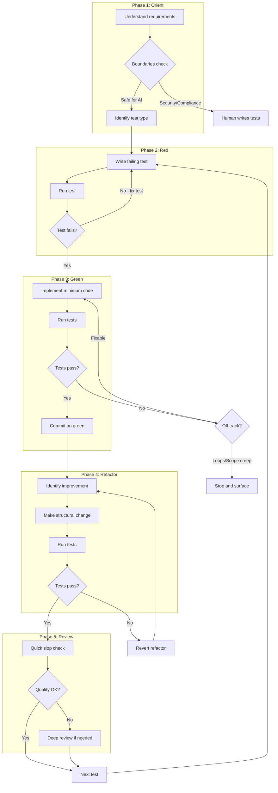
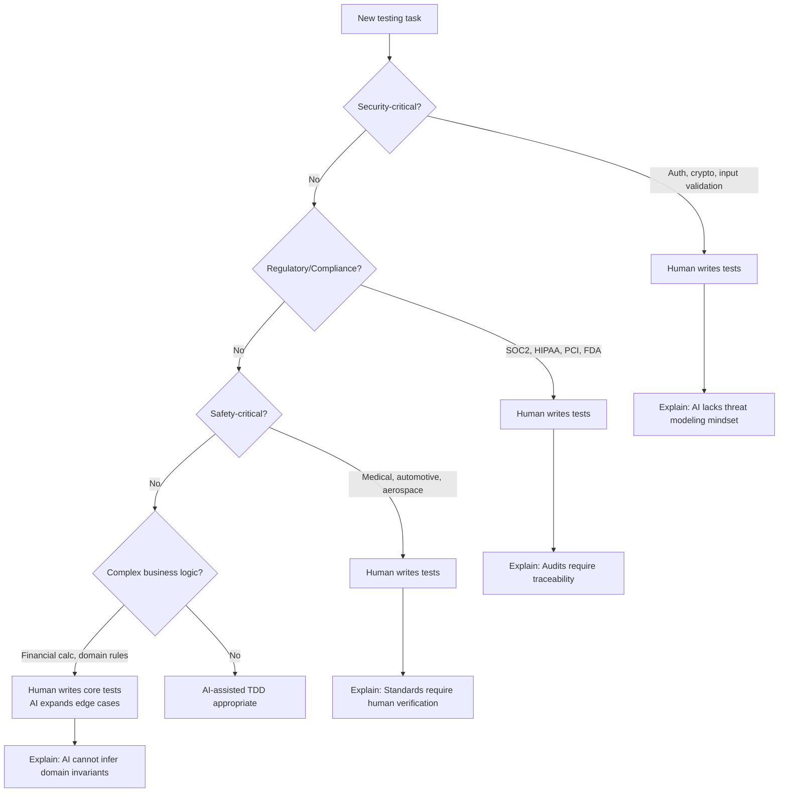
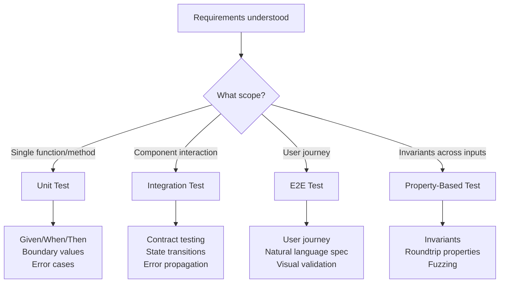
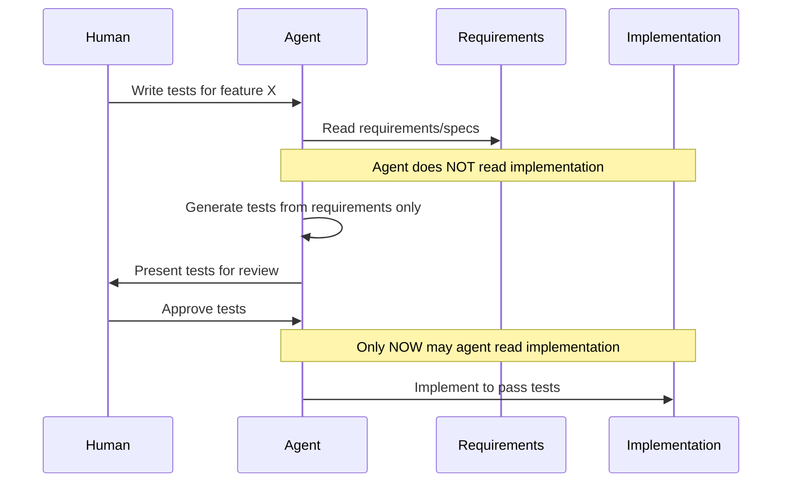
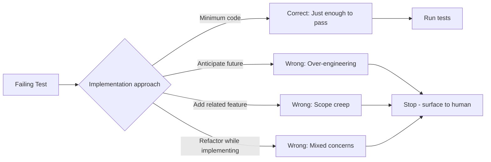
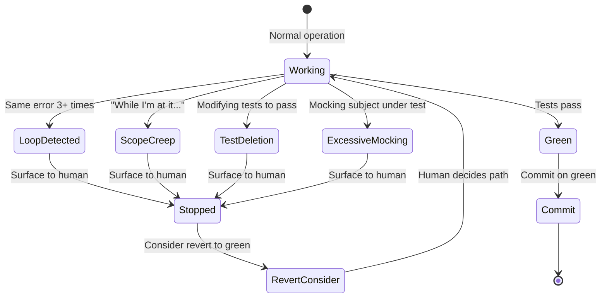
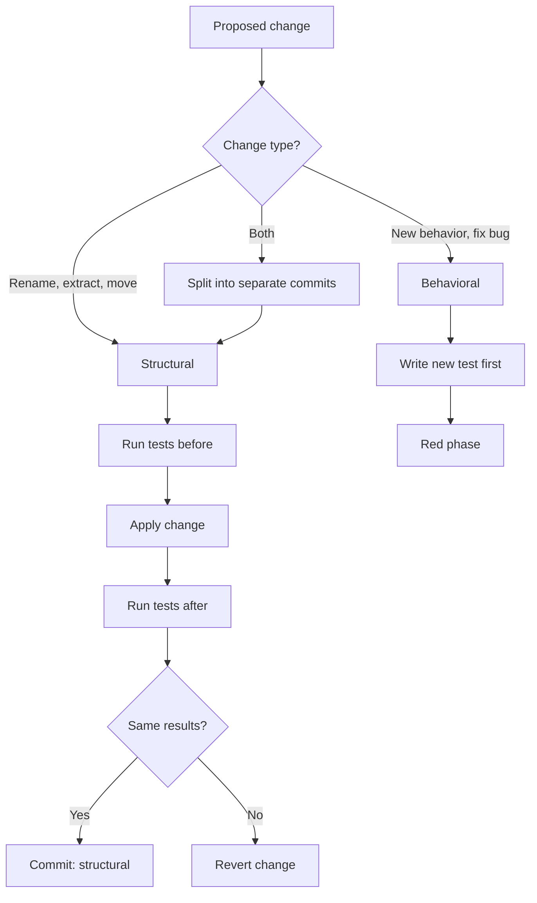
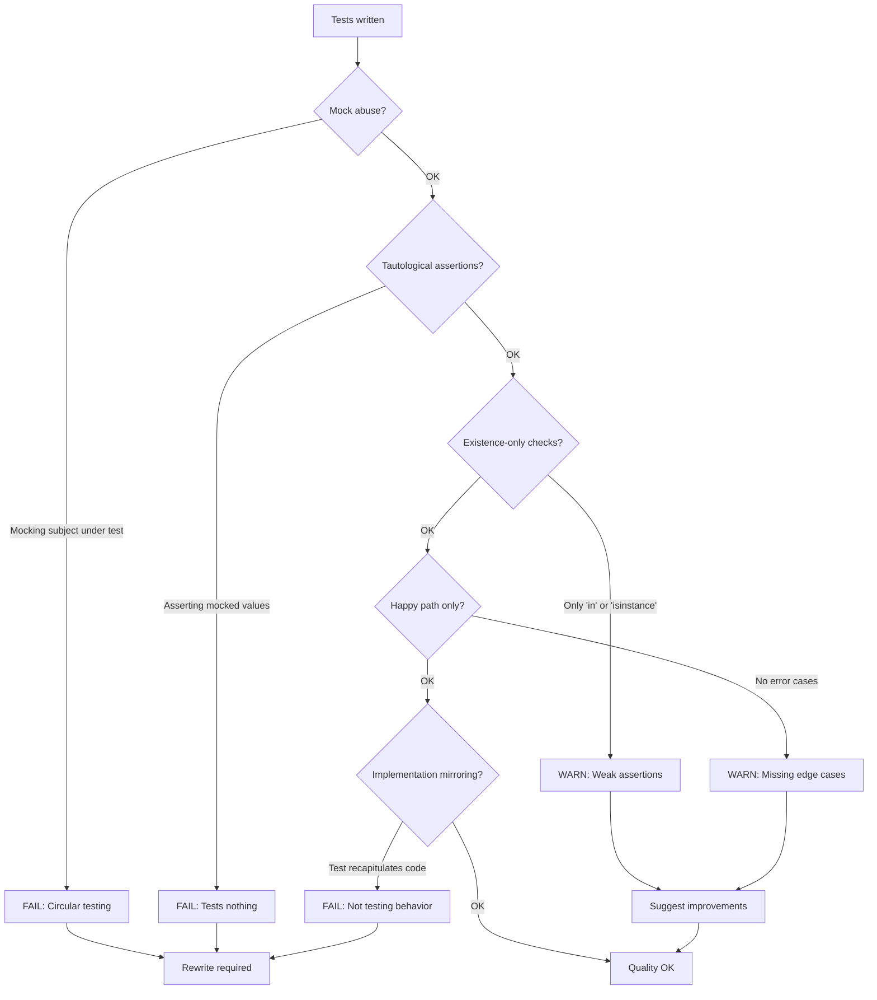

# Test-Driving-With-AI Skill Design

## Overview

This document defines the behavioral design for the `test-driving-with-ai` skill. The skill guides AI agents through Test-Driven Development, addressing AI-specific concerns that traditional TDD guidance does not cover.

### Core Philosophy

> "TDD served a critical function in AI-assisted development: it kept me in the loop. When you're directing thousands of lines of code generation, you need a forcing function that makes you actually understand what's being built. Tests are that forcing function."
> - Obie Fernandez

**The fundamental tension**: AI tests document what code *does*; human tests specify what code *should do*. TDD inverts the typical AI workflow - tests come from requirements, not implementation.

### Why TDD Matters More With AI

1. **Forcing function**: Tests force humans to understand what's being built
2. **Context management**: Broken code pollutes AI context; tests keep it clean
3. **Control mechanism**: TDD is how humans maintain control over AI output
4. **Quality signal**: Tests catch AI regressions and hallucinations

---

## Core Workflow



---

## Phase 1: Orient

The Orient phase determines WHAT behavior is being specified and WHETHER AI-assisted testing is appropriate.

### Boundaries Decision Tree



### Test Type Selection



---

## Phase 2: Red (Write Failing Test)

### Context Isolation

The agent should NOT read implementation code when writing tests from requirements. This prevents the AI from "peeking" at existing behavior and documenting bugs as features.



### Test Quality Criteria

A properly written test in the Red phase:

| Criterion | Good | Bad |
|-----------|------|-----|
| Specifies | WHAT should happen | HOW it works |
| Derives from | Requirements | Implementation |
| Scope | One behavior | Multiple behaviors |
| Assertions | Observable outcomes | Internal state |
| Complexity | Simplest failing case | Complex setup |

---

## Phase 3: Green (Make It Pass)

### Minimum Implementation Rule



### Warning Signs Detection



---

## Phase 4: Refactor

### Structural vs Behavioral Changes



---

## Phase 5: Review

### Quick Slop Detection

The agent performs rapid quality checks before considering work complete:



### Deep Review Triggers

Certain conditions require more thorough review:

| Trigger | Action |
|---------|--------|
| Complex business logic | Verify domain rules captured |
| Security boundaries | Check for missing threat cases |
| State machines | Verify all transitions tested |
| Mutation score < 70% | Generate tests for surviving mutants |

---

## Behavioral Requirements

### Orient Phase

```gherkin
Scenario: New feature development
  Given a user requests a new feature
  When the agent begins work
  Then the agent SHOULD ask what behavior is being specified
  And the agent SHOULD identify the test type needed
  And the agent SHOULD check for security/compliance boundaries
  And the agent SHOULD surface boundary concerns before proceeding

Scenario: Security-critical code detected
  Given the task involves authentication, cryptography, or input validation
  When the agent evaluates how to proceed
  Then the agent SHOULD recommend human-written tests
  And the agent SHOULD explain why AI tests are inappropriate
  And the agent SHOULD NOT proceed with AI test generation without acknowledgment
```

### Red Phase

```gherkin
Scenario: Writing the first test
  Given requirements are understood
  When the agent writes a test
  Then the test SHOULD specify WHAT should happen, not HOW
  And the test SHOULD be the simplest failing case
  And the agent SHOULD run the test to confirm it fails
  And the agent SHOULD NOT read implementation code first

Scenario: Context isolation
  Given the agent is writing tests for new functionality
  When generating test code
  Then the agent SHOULD derive tests from requirements only
  And the agent SHOULD NOT reference implementation details
  And the agent SHOULD focus on observable behavior
```

### Green Phase

```gherkin
Scenario: Implementing to pass
  Given a failing test exists
  When the agent implements code
  Then the implementation SHOULD be minimum code needed to pass
  And the agent SHOULD run tests immediately after
  And the agent SHOULD NOT add functionality beyond the test
  And the agent SHOULD commit when green

Scenario: Loop detection
  Given the agent is implementing
  When the same error occurs 3+ times with same approach
  Then the agent SHOULD stop
  And the agent SHOULD surface the situation to the human
  And the agent SHOULD NOT continue without human input

Scenario: Scope creep detection
  Given the agent is implementing
  When the agent considers adding unrequested functionality
  Then the agent SHOULD stop
  And the agent SHOULD ask the human before proceeding
  And the agent SHOULD NOT add "just one more thing"

Scenario: Test modification detection
  Given the agent is implementing
  When the agent considers modifying or deleting a test to pass
  Then the agent SHOULD stop immediately
  And the agent SHOULD surface this to the human
  And the agent SHOULD treat this as a critical warning sign
```

### Refactor Phase

```gherkin
Scenario: Refactoring after green
  Given tests are passing
  When the agent refactors
  Then structural changes SHOULD be separate from behavioral changes
  And tests SHOULD run after each refactoring step
  And the agent SHOULD revert if tests fail during refactor
  And the agent SHOULD NOT skip this phase

Scenario: Mixed change detected
  Given a proposed change affects both structure and behavior
  When the agent plans the change
  Then the agent SHOULD split into separate commits
  And structural changes SHOULD come first
  And behavioral changes SHOULD follow with new tests
```

### Review Phase

```gherkin
Scenario: Quick slop detection
  Given tests have been written
  When reviewing for quality
  Then the agent SHOULD check for mock abuse
  And the agent SHOULD check for tautological assertions
  And the agent SHOULD check for existence-only checks
  And the agent SHOULD check for missing error cases
  And the agent SHOULD surface any failures before proceeding

Scenario: Commit decision
  Given work on a test cycle is complete
  When deciding whether to commit
  Then the agent SHOULD commit only when ALL tests pass
  And the agent SHOULD consider "revert on red" if stuck
  And broken code SHOULD NOT remain in context
```

---

## Key Statistics to Reference

These statistics from research should inform agent behavior:

| Statistic | Source | Implication |
|-----------|--------|-------------|
| 0.4% useful tests | Wireframe.today | Most AI-generated tests are garbage |
| 84% coverage / 46% mutation score | KeelCode | Coverage lies; mutation testing reveals truth |
| 20.32% mutation scores | arXiv:2406.18181 | AI tests miss ~80% of bugs |
| 40%+ security flaws | Endor Labs | AI code often insecure |
| 5% test failures are flaky | ScienceDirect | Flakiness is common |

---

## Design Decisions

### Verbosity: Verbose

The agent explains each phase and its reasoning throughout the TDD workflow.

**Rationale:**
- Aligns with Obie's insight: "Tests force you to understand" - the skill should help humans learn, not just produce output
- Transparency builds trust in the agent's process
- Easier to catch when the agent goes off track
- Narrating decisions makes the "forcing function" visible

**Example output:**
```
ORIENT: Understanding what behavior we're specifying.

You've asked for user session timeout handling. Before I write any code,
I need to understand the expected behavior:
- What triggers a timeout? (inactivity duration)
- What should happen when timeout occurs? (redirect, message, cleanup)
- Are there any security implications? (This touches auth - let me flag that.)

RED: Writing a failing test first.

I'm writing a test based on requirements only - I won't look at any existing
session code to avoid documenting current behavior as expected behavior.

The simplest failing test: "session expires after 30 minutes of inactivity"

[writes test]

Running the test to confirm it fails...
Test fails as expected: "SessionManager has no attribute 'check_timeout'"

GREEN: Implementing minimum code to pass.

Now I'll implement just enough to make this one test pass. I won't add
timeout configuration, logging, or other features until we have tests for them.
```

### Revert Strategy: Never Automatic, Always Suggest

The agent never automatically reverts. On repeated failures, it surfaces the pattern and suggests options, then waits for human decision.

**Rationale:**
- Automatic revert could destroy work the human wanted to keep
- Maintains human control over destructive operations
- Aligns with "forcing function" - human must decide the path forward
- Broken context is bad, but losing work is worse

**Behavior:**
```
On any repeated failure pattern:
1. Stop and surface the pattern
2. Explain why this might indicate being off-track
3. Present options:
   - Revert to last green commit
   - Try a different approach
   - Human takes over
4. Wait for human decision
5. Do NOT proceed without explicit direction
```

**Example output:**
```
I'm seeing a pattern: same TypeError three times with similar approaches.

This often indicates one of:
- Missing dependency or import
- Incorrect assumption about the API
- Need for a different approach entirely

Options:
1. Revert to last green commit (cleans context, loses this work)
2. I try a different approach (describe what you'd like)
3. You take over from here

What would you like to do?
```

### Mutation Testing: Mandatory in Review Phase

Mutation testing is a required step in the Review phase, not optional.

**Rationale:**
- Coverage lies: 84% coverage with 46% mutation score = false confidence
- Only 0.4% of AI-generated tests are genuinely useful without validation
- Mutation score is the only reliable quality signal
- If we're being verbose and thorough, mutation testing fits

**Review Phase Workflow:**
```
REVIEW phase always includes:
1. Quick slop check (mock abuse, tautologies, existence-only)
2. Run mutation testing
3. Generate tests for surviving mutants
4. Iterate until 70% mutation score achieved
```

**Target Thresholds:**
| Context | Minimum Score |
|---------|---------------|
| Standard code | 70% |
| Complex business logic | 80% |
| Security-adjacent | 90% |

**Example output:**
```
REVIEW: Validating test quality.

Quick slop check: PASS
- No mock abuse detected
- Assertions verify values, not just existence
- Error cases covered

Running mutation testing...
Result: 58% mutation score (14/24 mutants killed)

10 mutants survived. Generating targeted tests for:
- Boundary: day <= 1 vs day < 1
- Return value: empty list vs None
- Condition: timeout > 0 vs timeout >= 0

[generates additional tests]

Re-running mutation testing...
Result: 79% mutation score (19/24 mutants killed)

Above 70% threshold. 5 surviving mutants are equivalent or low-risk.
Ready to proceed.
```

### Test Data: Quick Reference in SKILL.md, Details in Supporting Files

SKILL.md includes brief principles; `data/*.md` has full patterns and examples.

**Rationale:**
- Test data is essential but not the core focus
- Breaking flow to read another file disrupts TDD rhythm
- Brief inline guidance covers 80% of cases
- Deep patterns available when needed

**In SKILL.md:**
```
Test Data Principles:
- Use factories for complex objects (avoid inline construction)
- Use Faker for realistic values (names, emails, dates)
- Explicit edge cases, not random (boundary values you define)
- Reproducible: seed random generators for debuggability
```

**In data/factories.md:**
- Object Mother pattern
- Test Data Builder pattern
- factory_boy / FactoryBot examples
- Anti-patterns (excessive randomization, hardcoded test users)

**In data/fixtures.md:**
- Fixture management strategies
- Database seeding patterns
- Transaction rollback for isolation
- Shared vs isolated fixtures

### Phase Sequence: Fluid with Guardrails

Phases are guidance, not gates. Guardrails enforce only critical rules.

**Rationale:**
- Real TDD isn't strictly linear
- Sometimes Orient reveals unclear requirements mid-Red
- Sometimes Green reveals need for different test
- Sometimes Refactor discovers missing test cases
- Rigidity would fight natural workflow

**Hard Rules (Guardrails):**
```
1. Test MUST exist and fail before implementation begins
2. Tests MUST pass before commit
3. Warning signs ALWAYS trigger stop (loops, scope creep, test deletion)
4. Refactor phase SHOULD NOT be skipped entirely
```

**Soft Guidance:**
```
- Can return to Orient if requirements become unclear
- Can add tests during Refactor if gaps discovered
- Can skip Refactor for trivial changes (but acknowledge skipping)
- Phases are vocabulary for communication, not enforcement gates
```

**Example of natural flow:**
```
RED: Writing test for timeout behavior...

Actually, I realize the requirements don't specify what "timeout" means.
Is it inactivity timeout or absolute session duration?

ORIENT: Clarifying requirements before continuing.
[asks human]

RED: Now writing test for inactivity timeout...
```

### Existing Test Suites: Recognize the Scenario

The skill adapts behavior based on whether tests already exist.

**Greenfield** (no existing tests):
- Full TDD workflow as designed
- Maximum freedom in test structure

**Expanding** (adding to existing suite):
- Read existing test patterns first
- Follow conventions (describe structure, assertion style, naming)
- Still write test before new implementation
- Match the team's testing idioms

**Retrofitting** (adding tests to untested code):
- Acknowledge this is NOT TDD - code exists first
- Start with characterization tests (document current behavior)
- Then refactor with test coverage as safety net
- Be explicit: "This is retrofitting, not TDD"

**Example output (expanding):**
```
ORIENT: I see existing tests in tests/unit/auth/.

Reading test patterns... The suite uses:
- pytest with fixtures
- Given/When/Then naming: test_should_X_when_Y
- Factories via factory_boy
- Mocks via unittest.mock

I'll follow these conventions for the new tests.
```

**Example output (retrofitting):**
```
ORIENT: This code exists but has no tests.

This is retrofitting, not TDD - we're adding tests after the fact.
I'll start with characterization tests to document current behavior,
then we can refactor safely.

Note: Characterization tests may document bugs as "expected."
Review carefully before treating them as specification.
```

---

## Open Design Questions

---

## File Structure (Proposed)

```
.agents/skills/test-driving-with-ai/
├── SKILL.md                    # Core workflow (this design, executable)
├── patterns/
│   ├── unit-tests.md          # Unit test prompt patterns
│   ├── integration-tests.md   # Integration test patterns
│   ├── e2e-tests.md           # E2E and VLM-based testing
│   └── property-based.md      # Property-based testing
├── review/
│   ├── slop-catalog.md        # Full slop pattern catalog
│   └── mutation-testing.md    # Mutation testing workflow
├── data/
│   ├── factories.md           # Test data factory patterns
│   └── fixtures.md            # Fixture management
├── boundaries.md              # When NOT to use AI tests
└── maintenance.md             # Keeping tests healthy
```

---

## Next Steps

1. Review this design with stakeholder
2. Refine behavioral requirements based on feedback
3. Draft SKILL.md implementing the core workflow
4. Draft priority supporting files (unit-tests.md, slop-catalog.md)
5. Test with real TDD workflows
6. Iterate based on usage

---

*Design version: 0.1.0*
*Last updated: 2026-01-24*
